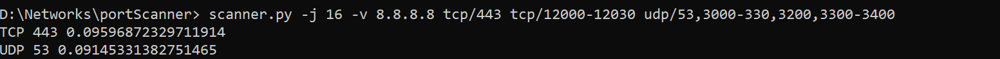

# Утилита "Сканер портов"

## Описание
Консольная утилита, сканирующая указанные TCP и UDP порты.

## Пример работы

## Пример запуска
* scanner.py [OPTIONS] IP_ADDRESS [{tcp|udp}[/[PORT|PORT-PORT],...]]... 
* scanner.py -j 16 -v 8.8.8.8 tcp/443 tcp/12000-12030 udp/53,3000-330,3200,3300-3400

## Параметры запуска
* `--timeout` — таймаут ожидания ответа (по умолчанию 2 секунды)
* `-j, --num-threads` — число потоков (в случае многопоточной реализации)
* `-v, --verbose` — подробный режим
* `-g, --guess` — определение протокола прикладного уровня